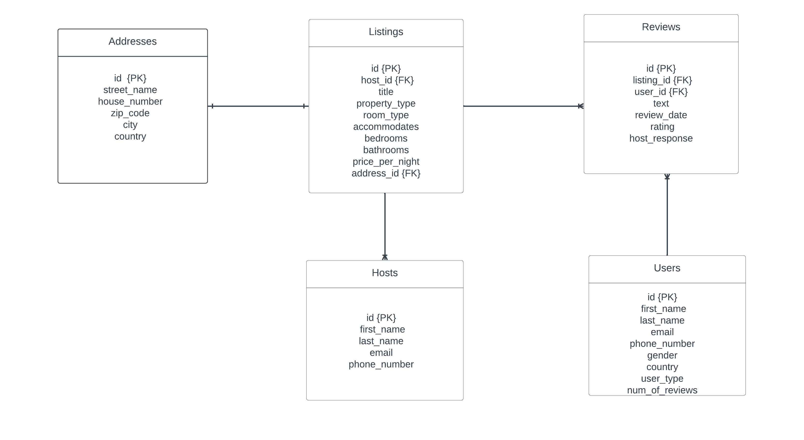

<!DOCTYPE html>
<html lang="en">
<head>
    <meta charset="UTF-8">
</head>
<body>
    <h1>Overview</h1>
    
The task is to create a database schema capable of efficiently storing, managing, and processing data pertaining to the use of Airbnb.
     
 
 

    <h2>Getting started</h2>

   <h3>How to run it?</h3>
   <ul>
     <li>Clone the repository from GitHub: git clone https://github.com/gianniprocida/data_mart_sql</li>
     <li>Navigate to the data_mart_sql: cd data_mart_sql</li>
     <li>Install any dependencies required by the project:
      <ul>
          <li>numpy.</li>
          <li>pandas.</li>
          <li>mysql-connector-python.</li>
          <li>sqlalchemy.</li> 
      </ul>
     </li>
     <li>Run the fun.py script to generate the CSV files and prepare them for insertion into the respective tables.</li>
     <li>Execute the script createTable.sql to create tables in the data_mart_airbnb database. </li>
    <li>Run the PopulateTables.py. This script will handle the insertion of the CSV files into the corresponding table.</li>
    <li>Run the script addPK.sql to add a primary key to each table</li>
    <li>Execute the script addFK.sql to establish relationships between tables in the database.</li>
   </ul> 
   <h2> </h2>    
<h2>Conception phase</h2>

{width=800px}
database management system for the Airbnb Use Case.
Figure shows the physical data model that contains an excerpt of a model for our database 
regarding the Airbnb use case. The squares represent our entities and are filled with attribues associated with our
entities. The arrows between the squares indicate how the entities relate to one anothe

</body>

